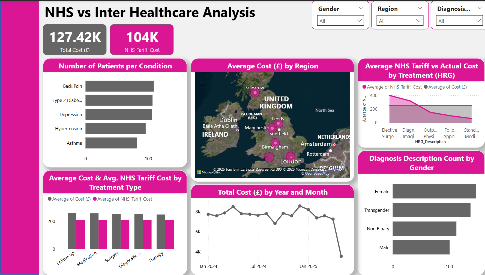

## 🏥 Healthcare Data Analysis & NHS Cost Benchmarking

 
A comprehensive healthcare data analytics project focused on internal patient records, cost efficiency, and national tariff comparison. This project leverages SQL and Power BI to deliver strategic insights into treatment costs, diagnosis trends, and regional health patterns.

## 📘 Project Overview

This analysis aims to support healthcare decision-making through the exploration of structured patient treatment data, cost benchmarking against NHS tariffs, and demographic-based insights. It ensures data integrity, transparency, and actionable reporting through a rigorous SQL-driven methodology and Power BI visualizations.

## 🔍 Objectives
- Clean and validate internal healthcare datasets
- Analyze high-frequency diagnoses and cost trends
- Benchmark internal costs against NHS tariff standards
- Assess demographic impact on healthcare outcomes
- Identify geographic patterns in healthcare demand
- Deliver interactive, insight-driven dashboards via Power BI

## 🧰 Tools Used
- SQL — for data structuring, cleaning, and Trend extraction.
- Power BI — for real-time, interactive dashboards

_You can access the Datasets files_ [here] [1](https://github.com/sameera-explores-data/Healthcare-Data-Analysis-NHS-Cost-Benchmarking/blob/main/uk_healthcare_dataset_with_nhs.csv) [2](https://github.com/sameera-explores-data/Healthcare-Data-Analysis-NHS-Cost-Benchmarking/blob/main/uk_healthcare_dataset.csv) [3](https://github.com/sameera-explores-data/Healthcare-Data-Analysis-NHS-Cost-Benchmarking/blob/main/patient_outcome_by_Age_group.csv) [4](https://github.com/sameera-explores-data/Healthcare-Data-Analysis-NHS-Cost-Benchmarking/blob/main/nhs_tariff.csv)

## 🗃️ Dataset and Preprocessing using SQL
- Missing Values: No null values detected across features
- Standardization: Unified column names and SQL-compatible date formats
- Data Types: Converted appropriate fields for query efficiency
- Outlier Detection: No irregular values detected
- Structured Insights: Records organized by diagnosis codes, treatments, cost, and visit frequency
- Over 60% of internal treatments exceeded NHS tariff guidelines, highlighting potential cost optimization opportunities.

_You can access the SQL file_ [here](https://github.com/sameera-explores-data/Healthcare-Data-Analysis-NHS-Cost-Benchmarking/blob/main/sql_queries.sql)

## 📈 Power BI Dashboard Highlights

# Features
1. Total Treatment Cost: £127.4K vs NHS Tariff Estimate: £104K
2. Top Diagnosed Conditions: Back Pain, Type 2 Diabetes, Depression
3. Cost Variance: Regional disparities in average treatment costs
4. Gender-Based Trends: Gender distribution varies per condition
5. Monthly Trend Analysis: Spending fluctuates £6K–£9K; minor recent decline
6. Interactive Filters: Gender, Region, Age, Diagnosis, Treatment Type

_You can access and interact with the Power BI dashboard_ [here](https://github.com/sameera-explores-data/Healthcare-Data-Analysis-NHS-Cost-Benchmarking/blob/main/Health_nhs_PowerBI_dashboard.pbix)

---
## Conclusions

The analysis reveals that diagnosis patterns vary across genders, with some conditions being more common in one gender than the other. This insight can help tailor healthcare interventions more effectively.

## Recommendations

Healthcare providers should use gender-specific trends to improve diagnosis accuracy and target health education programs to the right audience.

---
## 📂 Folder Structure
- PowerBI_Dashboard.png #Screenshot of the Power BI Dashboard
- SQL_Queries.SQL #SQL file
- Datasets
- Healthcare_Analysis_Project_Report.pdf #Detailed written report with insights
- README.md #Project documentation

## 🚀 How to Use
1. Download the `.pbix` file (Power BI file) from the repository.
2. Open with Power BI Desktop.
3. Connect to the provided Excel data source.
4. Explore the dashboard visuals and adjust filters as needed.

## 📝 Report Summary

A detailed written report is included in this repo (`Health_Project_Report.pdf`), summarizing all analytical findings and strategic recommendations for business optimization. 

[Health_Project_Report.pdf](https://github.com/sameera-explores-data/Healthcare-Data-Analysis-NHS-Cost-Benchmarking/blob/main/Health_Project_Report.pdf)

## 📌 Note
If you find this project insightful, feel free to star ⭐ the repo or connect with me for freelance collaborations or dashboard development projects.

---

